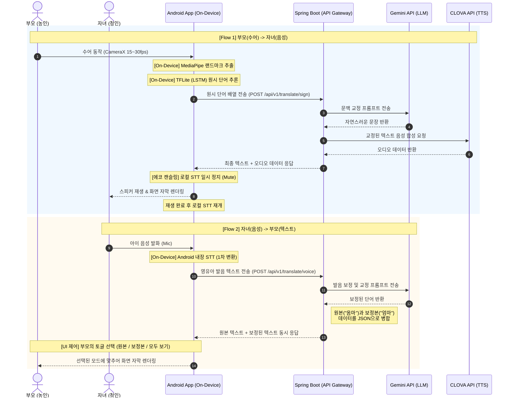

# 🏛️ 시스템 아키텍처 및 데이터 흐름도 (System Flow)

본 문서는 SUDA 프로젝트의 온디바이스(On-Device) AI 처리 과정과 Spring Boot API Gateway를 통한 외부 API(Gemini, CLOVA) 연동 시퀀스를 정의합니다.

## 1. 전체 시스템 시퀀스 다이어그램 (Sequence Diagram)

## 2. 단계별 데이터 흐름 상세 (Text Description)
> AI 에이전트의 컨텍스트 파악을 위한 텍스트 설명입니다.

### [Flow 1] 부모(수어) -> 자녀(음성) 흐름
1. **On-Device 처리:** 카메라 프레임에서 MediaPipe 좌표를 추출하고, TFLite 모델이 200ms 이내에 원시 단어(Gloss)를 도출합니다.
2. **Server 교정:** 안드로이드 앱이 원시 단어들을 보내면, Spring Boot가 Gemini API를 통해 자연스러운 문장으로 교정합니다.
3. **TTS 합성 및 반환:** 교정된 문장을 CLOVA TTS로 음성 파일화하여 앱으로 반환합니다.
4. **출력 및 제어:** 앱은 자막을 띄우고 스피커로 출력하며, **출력 중에는 에코 캔슬링을 위해 로컬 STT를 잠시 음소거(Mute)합니다.**

### [Flow 2] 자녀(음성) -> 부모(텍스트) 흐름
1. **On-Device STT:** 자녀의 발화를 외부 전송 없이 안드로이드 기기 내장의 `SpeechRecognizer`로 1차 텍스트화합니다. (예: "옴마")
2. **Server 발음 보정:** 1차 텍스트를 서버로 보내면, Gemini API가 영유아 발음 특성을 고려해 문맥에 맞는 보정 텍스트(예: "엄마")를 생성합니다.
3. **듀얼 응답(Dual Response):** 서버는 **원본 텍스트와 보정된 텍스트를 모두 포함한 JSON**을 앱으로 응답합니다.
4. **UI 맞춤 렌더링:** 안드로이드 앱은 사용자가 누른 **토글 버튼 상태(원본만 / 보정본만 / 모두 보기)**에 따라 수신된 데이터를 파싱하여 자막으로 표시합니다.
